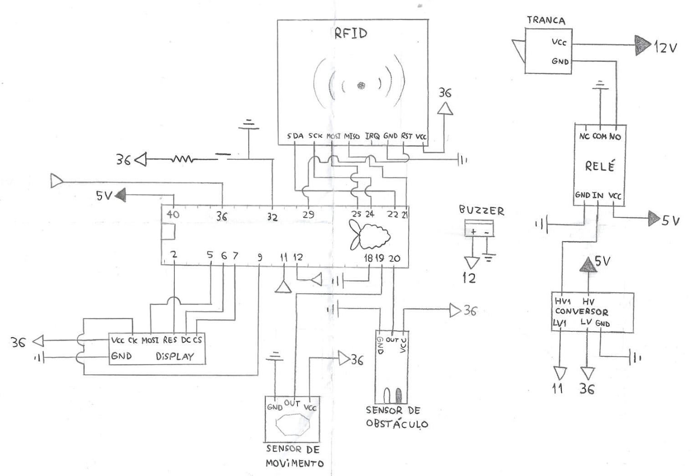

<h1>Maçaneta Eletrônica com Raspberry Pi Pico 🍓</h1>

Este é um projeto baseado no microcontrolador Raspberry Pi Pico, que consiste na construção de uma maçaneta eletrônica na qual seu funcionamento é liberado via a aproximação de um cartão TAG.

< Foto Final do Projeto >

<h2>⚙️ Funcionalidades do Sistema </h2>

<h4>🕺🏼 Detector de presença de pessoas para ativação da fechadura. </h4>
<h4>✅ Controle de autorização de acesso via aproximação de cartão TAG. </h4>
<h4>🚪 Exibição de mensagens ao usuário conforme o estado da porta (aberta ou fechada).</h4>
<h4>🚨 Deteção de Invasão.</h4>

<h2>🎬 Começando...</h2>

Essas instruções permitirão que você consiga realizar uma cópia do projeto em operação em seu Raspberry para fins de desenvolvimento e teste.

<h3>🕹️ Hardwares Utilizados</h3>

 * [🔗 Raspberry Pi Pico](https://www.amazon.com.br/LANDZO-Raspberry-Pi-Pico/dp/B08VNR5RLF)
 * [🔗 Display OLED SPI de 128x32]()
 * [🔗 Sensor de Movimento PIR HC-SR501](https://www.robocore.net/sensor-ambiente/sensor-de-presenca-pir-hc-sr501)
 * [🔗 Sensor de Obstáculos Reflexivo Infravermelho](https://www.eletrogate.com/sensor-de-obstaculo-reflexivo-infravermelho)
 * [🔗 Sensor de RFID com TAG](https://curtocircuito.com.br/kit-rfid-rc522.html)
 * [🔗 Trava Eletrica Solenoide 12 volts](https://produto.mercadolivre.com.br/MLB-2187293250-mini-trava-eletrica-solenoide-12v-arduino-raspberry-_JM?quantity=1)
 * [🔗 Rele de 5 volts]()
 * [🔗 Botão de arduino](https://arduinoeeletronica.com.br/produto/botao-microchave-push-button-4-pinos/)
 * [🔗 Buzzer simples sem módulo](https://www.acheicomponentes.com.br/circuitos-integrados/buzzer-piezo-ps1240p02bt-4khz-s-oscilador?parceiro=3811)

<h3>🧑🏻‍💻 Softwares Utilizados</h3>

 * [🔗 Thonny Python IDE](https://thonny.org/)
 * [🔗 MicroPython firmware](https://docs.micropython.org/en/latest/)


<h2>🚀 Instalação</h2>

<ul>
  <li><h3 id="secao-esquema-eletrico">Esquema Elétrico</h3></li>
</ul>



<h2 id="secao-testes">⚙️ Executando os testes individualmente</h2>

1. Montar em uma protoboard o sistema conforme a seção <a href="#secao-esquema-eletrico">⤴️ Esquema Elétrico.</a>

2. Utilizar um cabo Micro USB para conectar o Raspberry Pi Pico e seu computador.
    - Conectar a entrada Micro USB no Raspberry Pi Pico.
    - Conectar a entrada USB padrão em seu computador.

3. Abrir a IDE Thonny.
    
4. Fazer a SOMENTE a instalção do MicroPython firmware conforme a [🔗 documentação.](https://projects.raspberrypi.org/en/projects/getting-started-with-the-pico/3)

5. Armazene todos os arquivos listados neste repositório dentro do Raspberry Pi Pico.

6. Abra o diretório teste e o execute o arquivo teste.py existente em cada um dos diretórios listados abaixo:
    - Display_OLED
    - Sensor_Movimento_PIR-HC-SR501
    - Sensor_Obstaculo_Infravermelho
    - Sensor_RFID **(Armazene o número do(s) cartão(s) que deseja permitir o acesso)**

Cada arquivo teste.py tem sua execução de acordo a funcionalidade do periférico que está sendo testado.

> **Observação:** Se a inicialização de algum periférico não funcionar corretamente verifique se os mesmos estão corretamente conectados em seus respectivos pinos, conforme a seçao <a href="#secao-esquema-eletrico">⤴️ Esquema Elétrico</a>.

<h2>📦 Implementação</h2>

1. (Opcional) Deletar o diretório teste armazenado Raspberry Pi Pico.

2. Adicionar os valores do(s) cartão(s) que deseja permitir o acesso na penúltima linha do arquivo system.py. 
Este valores são encontrados ao executar o arquivo teste.py listado em Sensor_RFID conforme a seção <a href="#secao-testes">⤴️ Executando os testes individualmente</a>.
    - Ex: ``` list_cards = [296158778, 296158779] ```

2. Execute o arquivo system.py.

3. Se a execução acontecer com sucesso renomeie o arquivo system.py para main.py.

> **Importante:** Ao renomear o arquivo para main.py, toda vez que o Raspberry Pi Pico for conectado a uma fonte de energia o código contido em main.py será executado automaticamente, sem a necessidade de executar via Thonny.


<h2>✒️ Autores</h2>

* Fernando Henriques Neto &nbsp;18.00931-0 
* Guilherme Sanches Rossi &nbsp;&nbsp;19.02404-5 
* Luiz Fernando Rodrigues &nbsp;&nbsp;&nbsp;19.01358-2 
* Matheus Coelho Rocha  &nbsp;&nbsp;&nbsp;&nbsp;&nbsp;&nbsp;20.00391-9 
* Pedro Henrique S.Hein &nbsp;&nbsp;&nbsp;&nbsp;&nbsp;&nbsp;&nbsp;20.00134-7 


<h2>🎁 Expressões de gratidão</h2>

Agradecimentos aos professores [🔗 Sergio Ribeiro Augusto](https://br.linkedin.com/in/sergio-ribeiro-augusto-258a9ba0) e [🔗 Rodrigo de Marca Franca](https://br.linkedin.com/in/rodrigo-frança-847872b1) por todo suporte para a conclusão do Projeto.

---